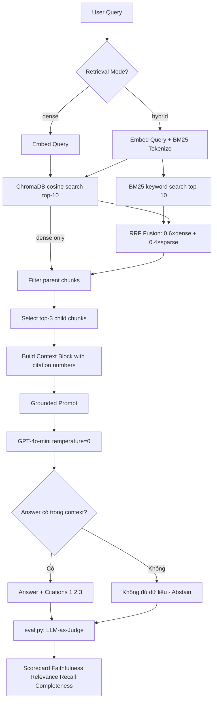

# Architecture — RAG Pipeline (Day 08 Lab)

**Môn:** AI in Action (AICB-P1)  
**Nhóm:** C401-C2  
**Bài toán:** Trợ lý nội bộ CS + IT Helpdesk  
**Documentation Owner:** Ngọc  
**Ngày hoàn thành:** 2026-04-13  

---

## 1. Tổng quan kiến trúc

Hệ thống xây dựng **trợ lý AI nội bộ** phục vụ nhân viên CS (Customer Support) và IT Helpdesk, trả lời câu hỏi về chính sách hoàn tiền, SLA ticket, quy trình cấp quyền hệ thống và FAQ — dựa trên tài liệu nội bộ thực tế. Toàn bộ câu trả lời đều phải có trích dẫn nguồn (`citation`) và nếu không đủ dữ liệu thì phải nói "Không đủ dữ liệu" (abstain).

```
┌─────────────────────────────────────────────────────────┐
│                    OFFLINE (index.py)                    │
│                                                          │
│  [5 tài liệu .txt]                                       │
│       ↓                                                  │
│  Preprocess (header extraction, text cleaning)           │
│       ↓                                                  │
│  Chunk (Parent-Child: heading → paragraph)               │
│       ↓                                                  │
│  Embed (OpenAI text-embedding-3-small)                   │
│       ↓                                                  │
│  Store → ChromaDB (cosine similarity, persistent)        │
└─────────────────────────────────────────────────────────┘
                          │
                    [ChromaDB]
                          │
┌─────────────────────────────────────────────────────────┐
│                  ONLINE (rag_answer.py)                  │
│                                                          │
│  [User Query]                                            │
│       ↓                                                  │
│  Retrieve (Dense / Hybrid BM25+Dense RRF)                │
│       ↓                                                  │
│  Select Top-3 Chunks                                     │
│       ↓                                                  │
│  Build Context Block (với citation số [1][2][3])         │
│       ↓                                                  │
│  Grounded Prompt → GPT-4o-mini                           │
│       ↓                                                  │
│  [Answer + Citation + Abstain nếu thiếu dữ liệu]        │
└─────────────────────────────────────────────────────────┘
                          │
┌─────────────────────────────────────────────────────────┐
│                 EVALUATION (eval.py)                     │
│                                                          │
│  10 Test Questions → Baseline & Variant Pipeline         │
│       ↓                                                  │
│  LLM-as-Judge (Faithfulness, Relevance, Recall, Complete)│
│       ↓                                                  │
│  Scorecard .md + grading_run.json + ab_comparison.csv   │
└─────────────────────────────────────────────────────────┘
```

---

## 2. Indexing Pipeline (Sprint 1)

**Owner:** Việt Anh

### Tài liệu được index

| File | Department | Nội dung chính | Số chunk (ước tính) |
|------|-----------|----------------|---------------------|
| `policy_refund_v4.txt` | CS | Chính sách hoàn tiền, ngoại lệ, thời hạn | ~8 |
| `sla_p1_2026.txt` | IT Support | SLA ticket P1: thời gian phản hồi, escalation | ~8 |
| `access_control_sop.txt` | IT Security | Approval matrix, cấp quyền Level 1-3 | ~8 |
| `it_helpdesk_faq.txt` | IT | FAQ: tài khoản bị khóa, reset password, WiFi | ~8 |
| `hr_leave_policy.txt` | HR | Nghỉ phép, remote work, chính sách 2026 | ~8 |

### Quyết định chunking

| Tham số | Giá trị | Lý do chọn |
|---------|---------|------------|
| **Chunk size** | 400 tokens (~1600 ký tự) | Đủ ngữ cảnh cho 1 điều khoản, không quá dài gây lost-in-middle |
| **Overlap** | 80 tokens (~320 ký tự) | Giữ ngữ cảnh khi điều khoản chạy qua ranh giới chunk |
| **Chiến lược** | **Parent-Child** theo heading `=== ... ===` | Phù hợp với cấu trúc tài liệu chính sách có section rõ ràng |
| **Metadata** | `source`, `section`, `department`, `effective_date`, `access`, `chunk_type`, `parent_id` | Phục vụ filter, freshness check, citation, debug |

**Chi tiết chiến lược Parent-Child:**
- **Parent chunk**: Toàn bộ nội dung 1 section → dùng để retrieve rộng
- **Child chunk**: Từng đoạn paragraph trong section → dùng để đưa vào prompt
- Khi retrieval, **chỉ dùng child chunks** để tránh context quá dài

### Embedding model

| Tham số | Giá trị |
|---------|---------|
| **Model** | `text-embedding-3-small` (OpenAI) |
| **Dimension** | 1536 |
| **Vector store** | ChromaDB `PersistentClient` (local, không cần server) |
| **Similarity metric** | Cosine (HNSW space = cosine) |
| **Collection** | `rag_lab` |

---

## 3. Retrieval Pipeline (Sprint 2 + 3)

**Owner:** Linh (Dense) + Minh/Thanh (Variant)

### Baseline — Sprint 2: Dense Retrieval

```
Query → embed(query) → ChromaDB.query(top-10) → filter parent chunks → top-3
```

| Tham số | Giá trị |
|---------|---------|
| **Strategy** | Dense (embedding cosine similarity) |
| **top_k_search** | 10 (search rộng) |
| **top_k_select** | 3 (gửi vào prompt) |
| **Rerank** | Không |
| **Filter** | Bỏ parent chunks (chỉ lấy child) |

**Điểm mạnh:** Hiểu ngữ nghĩa, xử lý tốt câu hỏi diễn đạt khác nhau  
**Điểm yếu:** Bỏ lỡ keyword chính xác (mã lỗi, tên viết tắt, alias)

### Variant — Sprint 3: Hybrid Retrieval (Dense + BM25 với RRF)

```
Query → [Dense: embed→ChromaDB] + [Sparse: BM25 trên toàn corpus]
      → Reciprocal Rank Fusion (RRF, k=60)
      → Merge & sort theo RRF score
      → top-3
```

| Tham số | Giá trị | Thay đổi so với baseline |
|---------|---------|--------------------------|
| **Strategy** | Hybrid (Dense 60% + BM25 40%) | ✅ Thay đổi duy nhất |
| **top_k_search** | 10 | Giữ nguyên |
| **top_k_select** | 3 | Giữ nguyên |
| **Rerank** | Không | Giữ nguyên |
| **dense_weight** | 0.6 | — |
| **sparse_weight** | 0.4 | — |

**Lý do chọn Hybrid (A/B Rule — chỉ đổi 1 biến):**
> Corpus của bài toán CS + IT Helpdesk chứa **cả hai loại ngôn ngữ:**
> - **Ngôn ngữ tự nhiên**: "Chính sách hoàn tiền trong vòng 7 ngày" → Dense xử lý tốt
> - **Từ kỹ thuật và alias**: "ERR-403-AUTH", "ticket P1", "Approval Matrix" (tên cũ của Access Control SOP) → Dense yếu, BM25 mạnh
>
> Câu q07 ("Approval Matrix để cấp quyền") là ví dụ điển hình: dense search không nối được alias → hybrid cải thiện context recall.

**RRF Formula:**
```
RRF_score(doc) = 0.6 × 1/(60 + dense_rank) + 0.4 × 1/(60 + sparse_rank)
```

---

## 4. Generation (Sprint 2)

**Owner:** Trường C

### Grounded Prompt Template

```
Bạn là một trợ lý AI chuyên nghiệp cho khối CS + IT Helpdesk.
Hãy trả lời câu hỏi CHỈ dựa trên các đoạn ngữ cảnh dưới đây.

QUY TẮC CỐT LÕI:
1. GROUNDED: Chỉ dùng thông tin có trong Context.
2. ABSTAIN: Nếu không đủ thông tin → trả lời "Không đủ dữ liệu".
3. CITATION: Trích dẫn [1], [2], [3] ở cuối mỗi ý chính.
4. NGÔN NGỮ: Trả lời bằng cùng ngôn ngữ với câu hỏi.

NGỮ CẢNH (CONTEXT):
[1] SOURCE: ... | SECTION: ... | DEPT: ... | DATE: ... | SCORE: 0.85
<chunk text>

[2] ...

CÂU HỎI: {query}
CÂU TRẢ LỜI:
```

### LLM Configuration

| Tham số | Giá trị | Lý do |
|---------|---------|-------|
| **Model** | `gpt-4o-mini` | Cân bằng chất lượng/tốc độ/chi phí |
| **Temperature** | `0` | Output ổn định, dễ so sánh khi eval |
| **Max tokens** | `512` | Đủ cho câu trả lời ngắn gọn có citation |
| **Embedding model** | `text-embedding-3-small` | Cùng model với indexing |

---

## 5. Evaluation (Sprint 4)

**Owner:** Ngọc

### 4 Metrics (LLM-as-Judge, thang 1-5)

| Metric | Câu hỏi | Cách đo |
|--------|---------|---------|
| **Faithfulness** | Answer có bám vào retrieved context không? | Judge so sánh answer với chunks_used |
| **Answer Relevance** | Answer có đúng trọng tâm câu hỏi không? | Judge đánh giá query vs answer |
| **Context Recall** | Retriever có lấy đúng nguồn không? | Partial match `expected_sources` vs retrieved |
| **Completeness** | Answer có đầy đủ so với expected không? | Judge so sánh answer vs expected_answer |

### Judge Prompt Pattern

```python
# Faithfulness:
"Given context: {chunks}\nAnswer: {answer}\nRate faithfulness 1-5.\nReturn JSON: {'score': N, 'reason': '...'}"
```

---

## 6. Failure Mode Checklist

> Dùng khi debug — kiểm tra lần lượt từ dưới lên

| Layer | Failure Mode | Triệu chứng | Cách kiểm tra |
|-------|-------------|-------------|---------------|
| **Index** | Chunk cắt giữa điều khoản | Answer thiếu vế sau của rule | `list_chunks()` → đọc text preview |
| **Index** | Metadata thiếu `effective_date` | Không filter được tài liệu cũ | `inspect_metadata_coverage()` |
| **Retrieval** | Dense bỏ lỡ exact keyword | q07 (alias), q09 (mã lỗi) recall thấp | `score_context_recall()` → xem missing |
| **Retrieval** | top-k quá thấp | Expected source không trong top-3/10 | Tăng `top_k_search` lên 15-20 |
| **Generation** | Answer không grounded | Faithfulness < 3 | `score_faithfulness()` < 3 → kiểm tra prompt |
| **Generation** | Không abstain đúng | q09 trả lời bịa thay vì "Không đủ dữ liệu" | Kiểm tra ABSTAIN rule trong prompt |
| **Generation** | Lost-in-middle | Context dài → quên thông tin ở giữa | Giảm `top_k_select`, dùng rerank |

---

## 7. Sơ đồ Pipeline (Mermaid)



---

## 8. Cấu trúc file nộp bài

```
lab/
├── index.py              ← Sprint 1 (Việt Anh)
├── rag_answer.py         ← Sprint 2+3 (Linh + Trường C + Minh/Thanh)
├── eval.py               ← Sprint 4 (Ngọc)
├── data/
│   ├── docs/             ← 5 tài liệu .txt
│   └── test_questions.json  ← 10 câu hỏi
├── results/
│   ├── scorecard_baseline.md
│   ├── scorecard_variant.md
│   └── ab_comparison.csv
├── logs/
│   └── grading_run.json
├── docs/
│   ├── architecture.md   ← File này (Ngọc)
│   └── tuning-log.md     ← Ngọc
└── reports/
    ├── group_report.md
    └── individual/
        └── [ten].md
```
